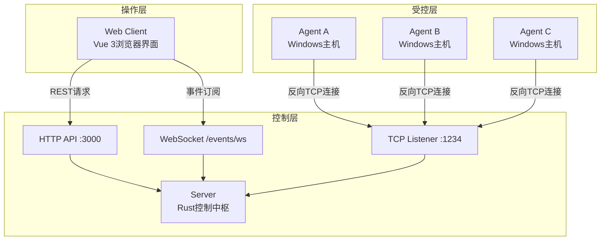
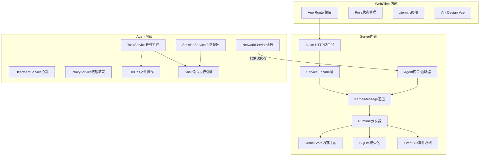
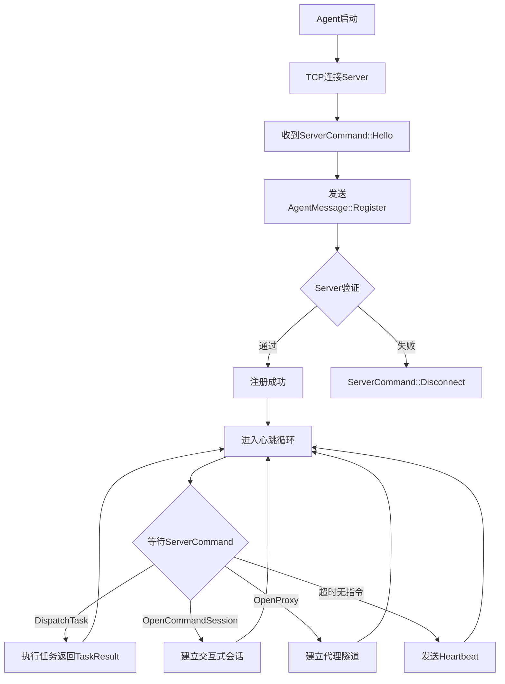
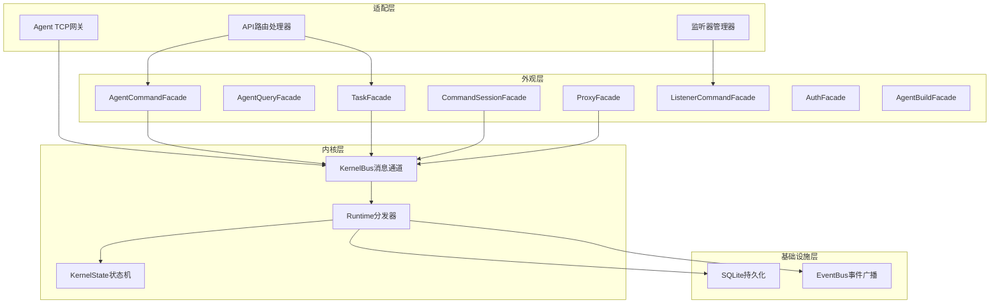
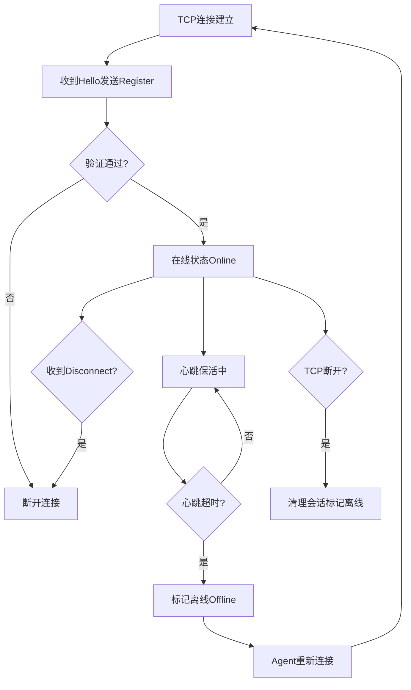
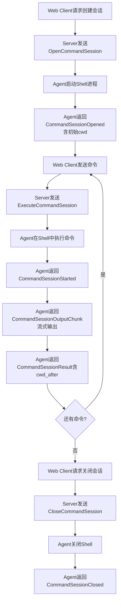
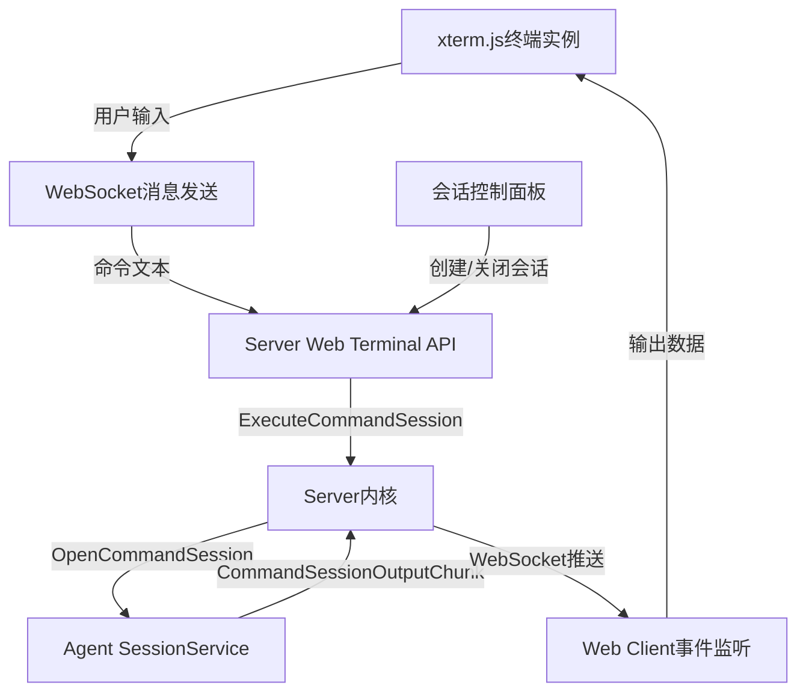
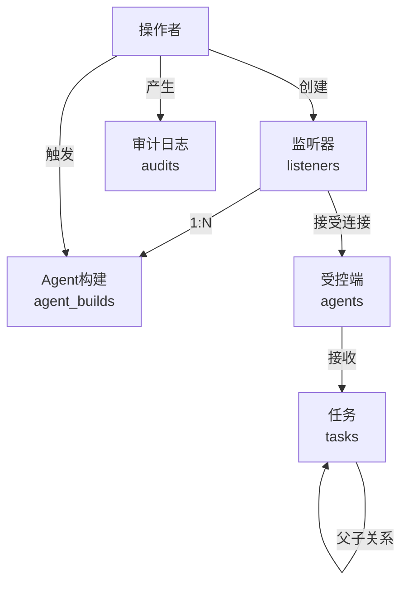

# 第4章 系统设计

上一章讨论了Hermes框架采用的核心技术和开发工具选型。从本章开始，进入系统的设计层面。一个C2框架的工程难点不在单个功能实现，而在各组件之间如何协调工作——Agent部署在目标主机上，Server运行在控制端，Web Client通过浏览器访问，三者必须通过稳定的协议和清晰的架构边界组合成一个可操作的整体。这一章会把设计思路拆开来逐层讲清楚：先确定系统运行环境，再从整体架构入手，接着展开通信协议、服务端微内核、客户端前端、Agent端各模块的详细设计，数据库设计放在最后。

## 4.1 系统运行环境

Hermes框架采用三层分布式部署模型，Server、Agent、Web Client三个组件分别运行在不同角色主机上。环境选型直接决定了系统可实现的功能边界和部署难度。下面按组件逐一说明。

### 4.1.1 服务端环境

Server是整个框架的控制中枢，需要长时间稳定运行，处理来自Agent的连接和来自Web Client的HTTP请求。服务端采用Rust语言编写，编译为原生二进制文件，不依赖运行时虚拟机。操作系统方面，Server支持Linux和macOS，生产环境推荐部署在Linux服务器上。网络层面需要开放两个端口：TCP监听端口（默认1234），用于接受Agent的反向连接；HTTP API端口（默认3000），用于接收Web Client的REST请求和WebSocket事件订阅。数据持久化依赖SQLite，无需额外部署数据库服务，数据文件存储在运行目录的data子目录下。构建工具链需要Rust 2024 edition编译器（当前使用nightly通道），构建命令通过Makefile封装。服务端的硬件要求不高，1核CPU和512MB内存即可支撑数十个Agent的同时在线。

### 4.1.2 客户端环境

Web Client是操作人员使用的浏览器界面，基于Vue 3构建。用户只需要一个现代浏览器（Chrome、Firefox、Edge均可），不需要在本地安装任何软件。开发环境需要Node.js运行时和npm包管理器，通过Vite启动开发服务器（默认端口5173）。生产环境下，Vite将整个前端应用编译为静态HTML、JavaScript和CSS文件，可部署在任意Web服务器上或直接由Server的HTTP服务托管。客户端与服务端之间通过HTTP API和WebSocket协议通信，所有数据交互均为JSON格式。前端使用Ant Design Vue组件库提供界面元素，使用Pinia进行状态管理，使用xterm.js提供浏览器内的终端模拟器体验。

### 4.1.3 Agent端环境

Agent是部署在目标主机上的受控端程序，这是整个框架对环境适应性要求最高的部分。Agent采用Rust 2021 edition编写，编译为独立的原生可执行文件，不依赖系统级运行时库。目标平台为Windows。Agent通过Win32 API和直接启动子进程的方式执行系统命令，所有系统信息采集、进程管理和截图功能均通过Windows原生API实现，不依赖PowerShell等外部命令。能正确处理GBK编码（代码页936）的命令输出。Agent的编译产出物体积经过专门优化，Release配置下采用opt-level="z"、codegen-units=1、LTO链接优化和panic=abort策略，将二进制文件压缩到最小尺寸。Agent通过交叉编译生成Windows平台版本，如x86_64-pc-windows-msvc目标。Agent还支持可选的TLS特性，通过启用tls feature标志，使用rustls库对TCP连接进行加密，支持自签名证书。Agent运行后不需要管理员权限，但某些操作（如截屏）在高权限上下文中效果更好。

## 4.2 系统总体设计

### 4.2.1 设计思想与原则

设计一个C2框架，核心矛盾是灵活性与可控性之间的平衡。操作者希望框架能执行各种远程管理任务，同时系统内部的状态流转又必须可追踪、可回溯。基于这个认知，Hermes的设计围绕以下几个原则展开。

微内核原则。Server端的核心业务逻辑集中在一个独立的内核模块中，所有外部输入（HTTP请求、Agent连接、WebSocket事件）必须通过统一的KernelMessage通道进入内核处理。API层和监听器层作为适配器存在，不允许直接操作内核状态。这种架构保证了任何业务变更只需修改内核或对应的外观接口，不会波及适配层。

协议优先原则。Agent与Server之间的通信协议是整个系统最稳定的集成面。所有通信消息（AgentMessage和ServerCommand枚举）集中定义在独立的protocol模块中，使用Serde的tagged enum序列化为JSON格式。协议一旦确定，Server和Agent可以独立迭代，只要协议不变就不会破坏兼容性。

分层职责原则。每一层有明确的职责边界。Protocol层只定义数据契约，不含业务逻辑。Adapter层（API路由、监听器网关）只处理传输关注点。Service Facade层作为内核的稳定入口。Runtime层负责消息路由和状态驱动。State层持有权威的内存状态。Storage层只做持久化和冷启动加载。依赖方向严格单向，禁止反向依赖。

可观测性原则。系统运行时的每一个操作都会生成审计日志（AuditLog），记录操作者、动作类型、目标对象和时间戳。Web Client通过WebSocket实时订阅系统事件，包括Agent上下线、任务状态变更、会话输出等。这些机制让操作者对系统行为保持完整的感知。

容错恢复原则。Server重启后能从SQLite数据库恢复未完成的任务状态，将中断的任务标记为失败。Agent端设置了panic hook捕获异常并写入日志文件。网络连接断开后，Agent会按照配置的重连间隔（默认3秒）自动尝试重新连接。任务执行设有超时机制，超时后自动终止子进程并返回超时错误。

### 4.2.2 三层分布式架构

Hermes框架采用经典的三层分布式架构。最底层是部署在目标主机上的Agent，中间层是运行在控制端的服务端Server，最上层是操作人员使用的Web Client浏览器界面。三层之间的通信关系是单向发起的：Agent主动向Server建立TCP连接，Web Client主动向Server发起HTTP请求和WebSocket连接。Server不主动连接任何一方，这种设计使Server可以在NAT后面安全运行。

下面用架构图展示三层的逻辑关系和数据流向：



如图所示，所有通信汇聚于Server。Agent之间不存在直接通信，所有协调工作由Server中转。Web Client不直接连接Agent，所有Agent操作都通过Server的HTTP API发起，由Server将指令转发给对应的Agent TCP连接。这种星形拓扑结构简化了网络配置，操作者只需确保Server的监听端口可达即可。

### 4.2.3 系统总体架构图

将三层的内部结构展开，得到系统的总体架构图。这张图更细致地展示了每个组件的内部模块划分和它们之间的调用关系：



这个架构图揭示了几个关键设计决策。Service Facade层将内核的入口点封装为类型安全的方法调用，外部模块（API路由、监听器网关）不需要了解内核的内部状态结构。Runtime分发器作为内核的消息循环，接收KernelMessage枚举，根据消息类型路由到对应的状态处理器。EventBus负责将内核状态变更广播给所有WebSocket订阅者。Agent端各Service之间通过mpsc通道（outbox）传递待发送消息，由主循环统一flush到网络层，避免了多线程直接操作网络连接的复杂性。

### 4.2.4 系统外部接口设计

系统的外部接口分为HTTP API、WebSocket事件流和TCP协议三种类型。

HTTP API接口：

| 接口路径 | 方法 | 功能说明 |
|---|---|---|
| /auth/login | POST | 用户登录，返回会话Token |
| /auth/logout | POST | 用户登出 |
| /auth/me | GET | 查询当前登录用户信息 |
| /health | GET | 健康检查 |
| /agents | GET | 获取在线Agent列表 |
| /agents/history | GET | 获取所有Agent历史记录 |
| /agents/{agent_id} | GET/PATCH/DELETE | 查询/更新/删除指定Agent |
| /agents/{agent_id}/enable | POST | 启用Agent |
| /agents/{agent_id}/disable | POST | 禁用Agent |
| /agents/{agent_id}/disconnect | POST | 断开Agent连接 |
| /agents/{agent_id}/tasks | POST | 向Agent派发任务 |
| /agents/{agent_id}/command-sessions | POST | 创建交互式终端会话 |
| /agents/{agent_id}/beacon-config | POST | 更新Agent心跳配置 |
| /agents/{agent_id}/upload | POST | 向Agent上传文件 |
| /agents/{agent_id}/download | POST | 从Agent下载文件 |
| /agents/{agent_id}/browse | POST | 浏览Agent文件系统 |
| /agents/{agent_id}/screenshot | POST | 截取Agent主机屏幕 |
| /agents/{agent_id}/proxy | GET/POST | 查询/创建代理转发 |
| /tasks | GET | 获取任务列表 |
| /tasks/{task_id} | GET/DELETE | 查询/取消指定任务 |
| /tasks/broadcast | POST | 广播任务到所有在线Agent |
| /listeners | GET/POST | 查询/创建监听器 |
| /listeners/{listener_id} | GET/PATCH/DELETE | 查询/更新/删除监听器 |
| /listeners/{listener_id}/enable | POST | 启用监听器 |
| /listeners/{listener_id}/disable | POST | 禁用监听器 |
| /listeners/{listener_id}/agent-builds | POST | 基于监听器生成Agent构建 |
| /agent-builds | GET/POST | 查询/创建Agent构建任务 |
| /agent-builds/{build_id} | GET/DELETE | 查询/删除构建任务 |
| /agent-builds/{build_id}/download | GET | 下载构建产物 |
| /command-sessions | GET | 获取命令会话列表 |
| /command-sessions/{id}/execute | POST | 执行命令 |
| /command-sessions/{id}/close | POST | 关闭会话 |
| /audits | GET | 查询审计日志 |
| /dashboard/stats | GET | 获取仪表盘统计数据 |
| /events/ws | GET | WebSocket事件订阅端点 |

WebSocket事件流：Web Client通过连接/events/ws端点订阅实时事件。Server在内核状态发生变更时，通过EventBus将事件推送给所有连接的WebSocket客户端。事件类型包括Agent上线（agent_connected）、Agent下线（agent_disconnected）、任务创建（task_created）、任务完成（task_completed）、命令会话输出（command_session_output_chunk）等。WebSocket连接支持自定义x-session-token和x-operator请求头进行身份认证。

TCP协议：Agent与Server之间的通信基于TCP长连接，消息格式为每行一个JSON对象。Server在Agent连接建立后，先发送ServerCommand::Hello消息，携带协议版本、会话随机数、认证模式等信息。Agent收到Hello后，回复AgentMessage::Register消息，携带自身的主机名、用户名、操作系统、架构、进程ID、内网IP、权限级别等系统信息。注册完成后进入心跳循环，Agent按配置的时间间隔发送AgentMessage::Heartbeat消息。Server需要下发指令时，发送对应的ServerCommand变体（DispatchTask、OpenCommandSession、OpenProxy等），Agent收到后执行并将结果通过AgentMessage变体返回。

## 4.3 通信协议设计

Agent与Server之间的通信协议是Hermes框架的核心集成面。这层协议的设计质量直接决定了整个系统能否稳定、高效地运转。本节从通信模型、消息格式、心跳机制三个维度展开讨论。

### 4.3.1 Agent与Server通信模型

Agent与Server的通信采用经典的请求-响应模型叠加异步通知。连接生命周期分为三个阶段：建立连接和注册、心跳保活、指令下发和结果回传。注册流程如下：



这个流程有几个值得注意的设计点。Hello消息中携带了session_nonce字段，这是一个服务端生成的随机数，可以用于后续的认证流程。Hello中的auth_mode字段告知Agent当前监听器采用的认证模式，Agent据此决定是否需要在Register消息中附带token或auth_response。capabilities字段声明了Server支持的功能列表，为后续协议扩展预留了空间。

注册成功后，Agent进入长时间的心跳循环。在每次循环迭代中，Agent尝试从TCP连接读取Server下发的指令。如果在心跳间隔内没有收到任何指令，Agent主动发送一个Heartbeat消息告知Server自己仍然存活。当Server需要执行操作时，直接在TCP连接上发送对应的ServerCommand，Agent在下一个读取周期内收到并处理。这种设计使得Server不需要等待Agent的心跳周期，指令可以立即下发，只是Agent的接收时机取决于它当前的读取状态。

Agent在收到Disconnect指令或网络连接中断时，退出当前循环，等待重连间隔后重新开始整个连接流程。重连间隔固定为3秒，这个值足够短以保证快速恢复，又不会因为高频重连造成网络负担。

### 4.3.2 消息格式设计

所有通信消息采用JSON格式编码，使用Serde的tagged enum特性实现多态反序列化。每条消息都是一个JSON对象，包含一个type字段作为消息类型的判别标签，其余字段是该消息类型的具体参数。

Agent发送给Server的消息定义在AgentMessage枚举中，核心变体及其用途如下表所示：

| AgentMessage变体 | 用途 | 关键字段 |
|---|---|---|
| Register | Agent注册，上报系统信息 | agent_id, hostname, os, arch, pid, privilege |
| Heartbeat | 心跳保活 | agent_id |
| TaskResult | 任务执行结果 | task_id, success, output |
| TaskUpdate | 任务中间状态更新 | task_id, status, output |
| ConfigUpdated | 确认配置变更 | request_id, sleep_interval, jitter |
| CommandSessionOpened | 会话已建立 | command_session_id, cwd |
| CommandSessionStarted | 命令开始执行 | command_session_id, request_id |
| CommandSessionOutputChunk | 会话输出流片段 | stream, chunk, sequence |
| CommandSessionResult | 单条命令执行结果 | line, cwd_before, cwd_after, exit_code, stdout, stderr |
| CommandSessionClosed | 会话已关闭 | command_session_id |
| ProxyOpened | 代理隧道已建立 | proxy_id, bind_addr |
| ProxyConnectResult | 代理连接结果 | proxy_id, stream_id, success |
| ProxyData | 代理数据传输 | proxy_id, stream_id, data_base64 |
| ProxyClosed | 代理流关闭 | proxy_id, stream_id |
| ProxyError | 代理错误 | proxy_id, detail |

Server发送给Agent的消息定义在ServerCommand枚举中：

| ServerCommand变体 | 用途 | 关键字段 |
|---|---|---|
| Hello | 握手，声明服务器能力 | protocol_version, session_nonce, auth_mode, capabilities |
| Ack | 确认消息 | message |
| DispatchTask | 下发任务 | task_id, command, payload |
| CancelTask | 取消任务 | task_id |
| UpdateBeaconConfig | 更新心跳配置 | request_id, sleep_interval, jitter |
| Disconnect | 要求Agent断开 | reason |
| OpenCommandSession | 创建交互式会话 | command_session_id |
| ExecuteCommandSession | 在会话中执行命令 | command_session_id, request_id, line |
| CloseCommandSession | 关闭会话 | command_session_id |
| OpenProxy | 开启代理隧道 | proxy_id, bind_addr |
| ProxyConnect | 建立代理连接 | proxy_id, stream_id, host, port |
| ProxyData | 传输代理数据 | proxy_id, stream_id, data_base64 |
| ProxyClose | 关闭代理流 | proxy_id, stream_id |
| CloseProxy | 关闭代理隧道 | proxy_id |

一条典型的Register消息序列化后如下：

```json
{"type":"register","agent_id":"DESKTOP-A1B2C3","hostname":"DESKTOP-A1B2C3","username":"admin","protocol_version":1,"os":"Windows 10","arch":"x86_64","pid":4812,"internal_ip":"192.168.1.105","privilege":"Medium","tags":[],"sleep_interval":15,"jitter":20}
```

Server回应的Hello消息：

```json
{"type":"hello","protocol_version":1,"session_nonce":"a3f2b1c4","listener_id":1,"listener_name":"default","transport":"tcp","capabilities":["task","session","proxy"],"auth_mode":"none"}
```

这种基于type标签的JSON格式有几个优点。可读性好，调试时可以直接阅读TCP流中的消息内容。扩展方便，新增消息类型只需在枚举中添加变体，不会影响已有消息的解析。兼容性强，未知消息类型的字段会被Serde忽略，便于协议向前演进。

### 4.3.3 心跳抖动与退避算法

心跳机制是C2框架反检测能力的关键环节。固定间隔的心跳会在网络流量中形成明显的周期性特征，容易被安全设备识别。Hermes在Agent端的HeartbeatService中实现了可配置的心跳抖动算法。

心跳间隔的计算公式为：

$$T_{actual} = T_{base} + random(0, T_{base} \times \frac{J}{100})$$

其中$T_{base}$是基础心跳间隔（单位秒），$J$是抖动百分比（0~100的整数），$random(a,b)$返回$[a,b]$范围内的伪随机整数。

在Agent端的实现中，schedule_from方法负责计算下一次心跳的到期时间：

```rust
fn schedule_from(&mut self, now: Instant) {
    let base_ms = self.interval_secs.saturating_mul(1000);
    let max_jitter_ms = base_ms.saturating_mul(self.jitter as u64) / 100;
    let jitter_ms = if max_jitter_ms == 0 {
        0
    } else {
        self.sequence = self.sequence.wrapping_add(1);
        let seed = SystemTime::now()
            .duration_since(UNIX_EPOCH)
            .map(|d| d.as_nanos() as u64)
            .unwrap_or(0)
            ^ ((std::process::id() as u64) << 16)
            ^ self.sequence;
        seed % (max_jitter_ms + 1)
    };
    self.next_due = now + Duration::from_millis(base_ms.saturating_add(jitter_ms));
}
```

伪随机数种子由当前时间戳（纳秒精度）、进程ID和递增序列号三个因子混合生成。时间戳因子保证每次调用的基础值不同，进程ID因子使不同Agent实例产生不同的随机序列，序列号因子确保同一个Agent的连续心跳也不会产生重复值。这种三因子混合策略在不引入外部随机源的情况下，生成了足够均匀的抖动分布。

默认配置下，基础间隔为15秒，抖动百分比为0（即不抖动）。操作者可以通过Server的HTTP API动态修改这两个参数。比如将基础间隔设为60秒、抖动设为30，那么实际心跳间隔将在60秒到78秒之间随机波动，有效模糊了流量特征。

当Agent存在活跃的命令会话或代理连接时，主循环会将读取超时缩短到100毫秒（与心跳间隔取较小值），以确保交互式操作的低延迟体验。这个快速轮询模式通过SessionService和ProxyService的should_poll_fast方法判断是否激活，在命令执行完毕或代理关闭后自动恢复正常间隔。

## 4.4 服务端详细设计

### 4.4.1 微内核架构设计

Server端采用微内核架构，将核心业务逻辑封装在独立的内核模块中，外部组件通过消息通道与内核交互。这种架构的核心思想是：所有状态变更必须经过统一的消息通道进入内核处理，保证状态流转的可追踪性和一致性。

微内核的分层结构如下：



各层之间的数据流遵循严格的单向依赖。外部输入（HTTP请求或Agent TCP帧）进入外观层后，外观层将操作转换为KernelMessage枚举变体，通过KernelBus发送给Runtime分发器。Runtime接收消息后，在KernelState上执行状态变更，并将变更结果持久化到SQLite，同时通过EventBus广播给WebSocket订阅者。

KernelMessage是内核的统一消息类型，定义为四域枚举：

```rust
pub enum KernelMessage {
    Agent(AgentKernelMessage),
    Task(TaskKernelMessage),
    CommandSession(CommandSessionKernelMessage),
    Proxy(ProxyKernelMessage),
}
```

每个域变体又包含多个具体消息。以Agent域为例：

```rust
pub enum AgentKernelMessage {
    Connected { session_id, listener_id, peer_addr, sender },
    Disconnected { session_id },
    Frame { session_id, frame: AgentMessage },
    UpdateBeaconConfig { agent_id, sleep_interval, jitter, respond_to },
    SweepHeartbeats,
}
```

Connected消息在Agent建立TCP连接时触发，携带session_id、listener_id、peer_addr和一个用于向Agent发送ServerCommand的mpsc通道sender。Frame消息封装了Agent发送过来的任何AgentMessage。UpdateBeaconConfig消息通过oneshot通道返回操作结果，实现了同步等待语义。

KernelState是系统在内存中的权威状态，由一系列HashMap组成：

```rust
pub struct KernelState {
    sessions: HashMap<u64, AgentSession>,          // session_id -> 会话
    agent_index: HashMap<String, u64>,             // agent_id -> session_id
    tasks: HashMap<String, TaskRecord>,            // task_id -> 任务记录
    command_sessions: HashMap<String, CommandSessionRecord>,
    command_executions: HashMap<String, CommandExecutionRecord>,
    proxy_sessions: HashMap<String, ProxySessionRecord>,
    proxy_streams: HashMap<String, ProxyStreamRecord>,
    pending_open_command_sessions: HashMap<String, oneshot::Sender<...>>,
    pending_command_executes: HashMap<String, PendingCommandExecute>,
    // ... 其他pending映射
}
```

sessions和agent_index构成了Agent的双向索引：通过session_id可以找到Agent会话的所有信息，通过agent_id可以快速定位到对应的session_id。pending系列HashMap存储了异步操作的oneshot回复通道，当Agent返回对应消息时，Runtime从中取出通道并将结果发送回去，从而实现请求-响应的同步等待语义。

RuntimePorts结构体封装了Runtime产生的副作用出口：

```rust
pub struct RuntimePorts {
    publisher: EventBus,        // 事件广播
    persistence: Storage,       // 数据持久化
}
```

Runtime在完成状态变更后，通过RuntimePorts执行副作用——将状态快照持久化到数据库，将变更事件广播给WebSocket客户端。这种将状态计算和副作用执行分离的设计，使得状态转换逻辑可以在不产生副作用的情况下进行单元测试。

### 4.4.2 监听器管理模块

监听器（Listener）是Server端负责接受Agent连接的网络服务。每个监听器绑定一个主机地址和端口，运行时作为独立的异步任务在后台监听入站TCP连接。系统支持三种监听器类型：

- TcpJson：纯TCP明文传输，消息格式为每行一个JSON对象
- HttpsJson：基于HTTPS的JSON传输，适用于需要Web代理穿透的场景
- PrivateProto：私有二进制协议（预留）

监听器数据模型定义如下：

```rust
pub struct ListenerRecord {
    pub listener_id: i64,
    pub name: String,
    pub kind: ListenerKind,
    pub bind_host: String,
    pub bind_port: u16,
    pub enabled: bool,
    pub config: Value,             // JSON配置
    pub runtime_status: ListenerRuntimeStatus,
    pub last_error: Option<String>,
    pub created_at: u64,
    pub updated_at: u64,
}
```

运行时状态有四种取值：Starting（启动中）、Running（运行中）、Stopped（已停止）、Error（异常）。监听器的生命周期通过ListenerCommandFacade管理，操作者通过HTTP API创建、启用、禁用、删除监听器。启用监听器时，Facade将命令通过KernelMessage发送给Runtime，Runtime在后台spawn一个异步监听任务。当有新的TCP连接到达时，监听任务为每个连接创建一个Agent网关会话。

每个Agent连接在通过网关进入内核后，网关会持有Agent的mpsc::UnboundedSender<ServerCommand>通道。内核需要向Agent发送消息时，直接通过这个通道写入ServerCommand，网关侧的异步任务将消息序列化为JSON并写入TCP连接。这种设计将网络I/O与业务逻辑彻底解耦——内核只需要调用send方法，不需要关心消息是如何到达Agent的。

### 4.4.3 Agent生命周期管理

一个Agent从首次连接到最终离线，经历以下状态变迁：



内核中的AgentSession结构体记录了每个在线Agent的完整状态：

```rust
pub struct AgentSession {
    pub session_id: u64,
    pub agent_id: Option<String>,
    pub listener_id: Option<i64>,
    pub listener_name: Option<String>,
    pub hostname: Option<String>,
    pub username: Option<String>,
    pub os: Option<String>,
    pub arch: Option<String>,
    pub pid: Option<u32>,
    pub internal_ip: Option<String>,
    pub tags: Vec<String>,
    pub sleep_interval: u64,
    pub jitter: u32,
    pub peer_addr: SocketAddr,
    pub connected_at: u64,
    pub last_seen: u64,
    pub sender: mpsc::UnboundedSender<ServerCommand>,
    pub privilege: String,
}
```

其中sender字段是Server向Agent发送指令的唯一通道。last_seen时间戳在每次收到Agent消息（包括Heartbeat）时更新。Runtime定期执行SweepHeartbeats消息，遍历所有在线会话，将超过阈值未更新的会话标记为离线。

Agent的启用/禁用机制通过is_disabled标志实现。被禁用的Agent即使在线，也不会接收任务派发。操作者可以通过HTTP API对Agent打标签（tags），方便在多Agent场景下进行筛选和批量操作。

### 4.4.4 任务调度模块

任务调度是Server最核心的功能之一。TaskRecord记录了每个任务的完整信息：

```rust
pub struct TaskRecord {
    pub task_id: String,
    pub parent_task_id: Option<String>,
    pub target_agent_id: Option<String>,
    pub command: String,
    pub payload: Option<String>,
    pub status: TaskStatus,
    pub created_at: u64,
    pub updated_at: u64,
    pub success: Option<bool>,
    pub output: Option<String>,
    pub children: Vec<String>,
}
```

task_id采用自增序列生成，格式为task_{sequence_number}。parent_task_id支持任务嵌套，比如广播任务（broadcast）会为每个Agent生成子任务，子任务的parent_task_id指向广播任务的task_id。children字段记录了所有子任务的ID列表。

任务状态流转如下：

| 当前状态 | 触发条件 | 目标状态 |
|---|---|---|
| pending | 目标Agent在线 | dispatched |
| pending | 目标Agent不在线且不是广播 | queued |
| dispatched | Agent返回TaskResult（成功） | completed |
| dispatched | Agent返回TaskResult（失败） | failed |
| dispatched | Server重启恢复 | failed |
| 任意 | 操作者取消 | cancelled |

TaskFacade提供了三个核心操作：dispatch（向指定Agent派发任务）、broadcast（向所有在线Agent广播任务）、cancel（取消任务）。dispatch操作会检查目标Agent是否在线，如果在线则立即将任务通过KernelMessage发送给目标Agent的sender通道。broadcast操作会为每个在线Agent创建独立的子任务，并行派发。

Server重启时，bootstrap过程会从SQLite加载所有未完成的任务（状态为pending或dispatched），将它们恢复到内核状态中。状态为dispatched的任务被标记为失败，原因是server restarted before task reached terminal state。这种恢复策略确保了任务不会因为Server重启而永远卡在中间状态。

### 4.4.5 交互式终端会话

交互式终端会话（CommandSession）是Hermes区别于简单任务派发的关键功能。普通的任务派发是一次性的——下发命令，等待结果。交互式会话则维持一个持久的Shell上下文，操作者可以在同一个工作目录中连续执行多条命令，就像直接在目标主机的终端中操作一样。

CommandSession的内核数据结构：

```rust
pub struct CommandSessionRecord {
    pub command_session_id: String,
    pub agent_id: String,
    pub cwd: String,
    pub status: CommandSessionStatus,
    pub created_by: String,
    pub created_at: u64,
    pub last_active_at: u64,
    pub active_command_id: Option<String>,
    pub queued_command_ids: VecDeque<String>,
}
```

cwd字段记录了会话当前的工作目录，每次命令执行完毕后由Agent上报的cwd_after更新。active_command_id和queued_command_ids实现了命令队列机制——同一时刻只能有一个命令在执行，后续命令排队等待。

会话的完整工作流程：



CommandSessionOutputChunk消息支持流式输出，sequence字段保证输出片段的顺序性。每条命令的完整结果通过CommandSessionResult返回，包含exit_code、stdout、stderr以及执行前后的工作目录路径。

Web Client通过Server提供的Web Terminal API（/web/terminal/*系列端点）和专用WebSocket端点（/web/terminal/ws）与会话交互。这个中间层将CommandSession的命令-响应模式转换为WebSocket的双向流式通信，使浏览器端的xterm.js组件能够实时显示命令输出。

### 4.4.6 代理转发模块

代理转发功能允许操作者通过Agent建立到目标内网其他主机的网络隧道。这在渗透测试场景中非常有用——Agent可以作为跳板，将操作者的网络请求转发到Agent能访问但Server不能直接访问的内网主机。

代理转发的数据模型：

```rust
pub struct ProxySessionRecord {
    pub proxy_id: String,
    pub agent_id: String,
    pub bind_addr: String,
    pub status: ProxySessionStatus,
    pub active_stream_ids: HashSet<String>,
    pub created_at: u64,
    pub updated_at: u64,
    pub last_error: Option<String>,
}

pub struct ProxyStreamRecord {
    pub stream_id: String,
    pub proxy_id: String,
    pub target_host: String,
    pub target_port: u16,
    pub client_sender: mpsc::UnboundedSender<Option<Vec<u8>>>,
}
```

一个ProxySession代表一个代理隧道实例，可以包含多条并发的数据流（Stream）。每条Stream对应一个到目标主机的TCP连接。client_sender通道用于将Server端收到的客户端数据转发给等待中的API请求处理器。

代理隧道的建立过程：Server向Agent发送OpenProxy指令，Agent在本地创建监听并返回ProxyOpened。当操作者需要连接内网主机时，Server发送ProxyConnect指令（携带目标host和port），Agent尝试建立TCP连接并返回ProxyConnectResult。连接成功后，双向数据通过ProxyData消息传输，数据内容采用base64编码。关闭连接时，任一方发送ProxyClose，整个隧道销毁时发送CloseProxy。

数据在Agent到Server方向的传输路径为：目标主机→Agent TCP连接→base64编码→ProxyData消息→Server Kernel→client_sender通道→HTTP API响应。反方向类似，只是数据流向反转。Server端充当了TCP连接到HTTP请求的协议转换桥梁。

### 4.4.7 Agent构建服务

Agent构建服务负责根据操作者的配置参数，自动化编译Agent二进制文件。这项功能免去了操作者手动配置编译环境和修改Agent配置的繁琐工作。

构建任务记录的数据结构：

```rust
pub struct AgentBuildRecord {
    pub build_id: i64,
    pub target_triple: String,     // 目标平台三元组
    pub profile: String,            // 编译配置
    pub listener_id: Option<i64>,   // 关联的监听器
    pub server_addr: String,        // Server回连地址
    pub embedded_agent_token: bool,  // 是否嵌入认证令牌
    pub artifact_path: Option<String>,  // 产物文件路径
    pub artifact_name: Option<String>,  // 产物文件名
    pub status: AgentBuildStatus,    // 构建状态
    pub detail: Option<String>,      // 详细信息
    pub created_at: u64,
    pub updated_at: u64,
}
```

构建状态有三种取值：Pending（排队中）、Succeeded（成功）、Failed（失败）。操作者可以通过两种方式发起构建：直接调用/agent-builds端点指定所有参数，或者通过/listeners/{id}/agent-builds端点，自动继承监听器的连接参数。

构建过程在后台线程中执行。Server调用cargo build命令编译Agent项目，通过环境变量将server_addr和agent_token注入到Agent的配置中。编译完成后，产物文件保存在data目录下，操作者通过/agent-builds/{id}/download端点下载。如果编译失败，detail字段记录错误信息供排查。

## 4.5 客户端详细设计

### 4.5.1 页面路由与组件结构

Web Client基于Vue 3框架开发，使用Vue Router管理页面导航。系统采用单页应用（SPA）模式，所有页面共享一个Layout布局组件。路由配置定义了以下核心页面：

| 路由路径 | 页面组件 | 功能说明 |
|---|---|---|
| /login | Login.vue | 登录页面 |
| /dashboard | dashboard/index.vue | 系统总览仪表盘 |
| /agent | agent/index.vue | Agent节点管理 |
| /agent/:id/session | agent/session.vue | 单个Agent的交互式会话面板 |
| /listener | listener/index.vue | 监听器管理 |
| /payload | payload/index.vue | 载荷生成 |
| /log | log/index.vue | 操作审计日志 |

路由守卫实现了认证保护。每个受保护路由在首次访问时，会调用Server的/auth/me接口验证会话有效性。如果会话失效（Token过期或Server重启），自动跳转到登录页。登录页面存储的连接信息（Server地址和API Token）保存在Pinia的connection store中。

页面布局采用Ant Design Vue的Layout组件，左侧为导航菜单，右侧为主内容区域。导航菜单根据当前路由高亮对应菜单项。总览仪表盘页面展示在线Agent数量、活跃任务数、监听器状态等统计信息。Agent管理页面以表格形式展示所有Agent，支持按标签筛选和批量操作。点击单个Agent进入会话面板，可以执行命令、管理文件、查看系统信息。

### 4.5.2 状态管理与事件订阅

客户端使用Pinia作为全局状态管理库。核心Store包括：

- ConnectionStore：管理Server连接配置和会话认证状态，存储activeProfile（包含server_url和api_token）
- 各业务Store：按功能模块划分，分别管理Agent列表、任务列表、监听器列表、审计日志等数据

WebSocket事件订阅是客户端实时更新的核心机制。页面加载时建立与Server的/events/ws连接，接收Server推送的状态变更事件。事件到达后，对应的Pinia Store自动更新状态，Vue的响应式系统驱动页面重新渲染。这种单向数据流（Server推送事件→Store更新→组件重渲染）保证了界面状态与Server状态的实时同步。

WebSocket连接需要携带认证信息。客户端在连接时通过自定义HTTP头（x-session-token和x-operator）传递会话凭据。Server验证通过后才允许订阅事件。如果WebSocket连接意外断开，客户端会自动尝试重连。

### 4.5.3 交互式终端组件设计

Agent交互式终端是Web Client中最复杂的UI组件，基于xterm.js库实现浏览器内的终端模拟器体验。组件设计需要解决几个核心问题：双向数据流、输入处理、输出渲染、会话生命周期。

组件架构如下：



用户在xterm.js组件中输入命令文本，按回车键后，命令通过WebSocket发送到Server的Web Terminal API。Server将命令转发给Agent的SessionService执行。Agent执行过程中产生的输出以CommandSessionOutputChunk消息流式回传，Server通过专用WebSocket端点将输出推送到浏览器，xterm.js接收到数据后实时渲染到终端画布上。

xterm.js组件配置了终端主题、字体大小、光标样式等参数，以模拟真实的终端体验。组件还处理了终端的resize事件，当浏览器窗口大小改变时，通知xterm.js重新计算行列数。终端组件与会话面板集成在同一个页面中，操作者可以在终端旁边的面板中查看Agent的系统信息、文件浏览器和任务历史。

## 4.6 Agent端详细设计

Agent是Hermes框架中部署在目标主机上的受控程序。它的设计目标是体积小、依赖少、运行稳定、功能完整。Agent采用微内核插件式架构，各功能模块以Service的形式注册到主循环中，通过mpsc通道与网络层通信。

### 4.6.1 通信与心跳模块

NetworkService是Agent的网络通信基础模块，负责TCP连接的建立、数据发送和接收。它支持两种编译模式：默认的纯TCP模式和可选的TLS加密模式。

在纯TCP模式下，NetworkService通过TcpStream::connect建立到Server的连接，设置30秒的读写超时，并启用TCP_NODELAY选项禁用Nagle算法以降低小包延迟。发送消息时，将序列化后的JSON字符串加上换行符写入TCP流。接收消息时，从TCP流按行读取（以换行符为分隔符），解析为ServerCommand枚举。

在TLS模式下，NetworkService在TCP连接之上封装rustls的客户端连接。TLS客户端配置跳过了服务器证书验证（接受自签名证书），使用hermes作为ServerName。连接建立后，会循环调用complete_io直到TLS握手完成。后续的读写操作通过rustls的StreamOwned类型进行，对上层调用者透明。

HeartbeatService如前文所述，实现了可配置的心跳抖动算法。它的接口设计简洁：构造时设定默认间隔和抖动，should_send方法判断是否到了发送时机，sent方法在发送心跳后重新调度，update方法接受Server下发的配置变更并立即生效。HeartbeatService还实现了Plugin trait，使其可以注册到Agent的微内核中。

### 4.6.2 指令解析与执行引擎

Agent收到ServerCommand后，在主循环的match分支中进行分发。核心分发逻辑如下：

```rust
match cmd {
    ServerCommand::DispatchTask { task_id, command, payload } => {
        task.lock().unwrap().dispatch(&task_id, &command, payload.as_deref());
    }
    ServerCommand::OpenCommandSession { command_session_id } => {
        session.lock().unwrap().open(&command_session_id);
    }
    ServerCommand::ExecuteCommandSession { command_session_id, request_id, line } => {
        session.lock().unwrap().execute(&command_session_id, &request_id, &line);
    }
    ServerCommand::CloseCommandSession { command_session_id } => {
        session.lock().unwrap().close(&command_session_id);
    }
    ServerCommand::Disconnect { .. } => return Ok(()),
    // ... Proxy相关命令类似
}
```

TaskService的dispatch方法是命令执行的总入口。它首先判断命令类型：如果是内置文件操作（upload/download/browse），路由到FileOps模块处理；如果是内置系统操作（如screenshot），路由到SysOps模块处理；其余命令视为通用Shell命令，由spawn_shell_process创建子进程执行。

通用命令的执行流程：

1. 调用spawn_operation创建子进程
2. 将RunningTaskHandle（包含PID和取消标志）注册到running映射表
3. 在独立线程中等待子进程完成（wait_child）
4. 解码输出（decode_output）
5. 构造TaskResult消息并通过outbox通道发送
6. 从running映射表中移除任务句柄

spawn_shell_process是实际的命令执行函数，通过直接解析命令字符串并启动子进程的方式执行，不再依赖cmd.exe中转。该函数设置CREATE_NO_WINDOW创建标志防止子进程弹出控制台窗口，并通过raw_arg方法传递原始参数字符串，避免Shell对参数进行二次解释。命令的超时控制通过wait_child函数实现——如果设置了超时时间，会在独立线程中等待子进程完成，超时后调用terminate_process强制终止。terminate_process通过Win32 API（OpenProcess + TerminateProcess）直接终止目标进程，不调用外部命令。

### 4.6.3 文件操作模块

FileOps模块处理三种内置文件操作：

upload（上传）：接收包含remote_path和content_base64的JSON payload，将base64解码后的内容写入指定路径。如果目标目录不存在，会自动创建父目录。写入完成后返回上传字节数。

download（下载）：读取指定路径的文件内容，将原始字节通过base64编码后作为TaskResult的output字段返回。Server端收到后进行base64解码即可获得原始文件内容。

browse（浏览）：列出指定目录下的所有条目，返回包含文件名、大小、修改时间、是否为目录等元数据的JSON数组。这个功能用于Web Client的文件浏览器界面。

文件操作在独立线程中执行，避免阻塞主循环。操作结果通过mpsc通道发送给主循环，由flush_outbox统一发送到Server。所有路径参数都通过Path模块处理，确保路径分隔符在不同平台上的正确性。

### 4.6.4 代理转发模块

Agent端的ProxyService负责代理隧道的实际数据转发。它与Server端的代理模块协同工作，形成一个从Server→Agent→目标主机的数据通道。

ProxyService管理的核心状态是一个代理会话映射表，每个会话记录了绑定地址和活跃的TCP连接。收到OpenProxy指令后，ProxyService在本地网络栈上创建一个TCP连接池的入口点（不是真正的TCP监听器，而是逻辑上的代理会话）。收到ProxyConnect指令后，ProxyService向指定的host:port发起TCP连接，连接成功后返回ProxyConnectResult。

数据转发是一个双工过程。Agent收到ProxyData消息后，将base64解码的数据写入到目标主机的TCP连接。反过来，从目标主机TCP连接读取的数据被base64编码后，通过ProxyData消息发送回Server。每条数据流有唯一的stream_id标识，支持在同一代理会话中复用多条并发流。

ProxyService通过should_poll_fast方法和flush_hint标志参与主循环的快速轮询机制。当存在活跃的代理连接时，主循环将读取超时缩短到100毫秒，以降低代理转发的延迟。

### 4.6.5 异常捕获与自我保护

Agent运行在不可控的目标主机环境中，必须具备完善的异常处理和自我保护机制。

Panic处理：Agent启动时注册全局panic hook，将panic信息写入本地日志文件（agent_debug.log）。默认情况下，panic会导致进程退出，Agent利用下一个心跳周期触发Server端的心跳超时检测，从而被标记为离线。

连接异常：主循环的run_once函数在连接失败、发送失败或读取异常时返回Err(())，外层循环等待reconnect_secs（默认3秒）后重新调用run_once。这种结构保证了任何网络异常都会触发自动重连。

命令超时：TaskService和SessionService在执行命令时都设置了超时机制。超时后调用terminate_process强制终止子进程。terminate_process通过Win32 API（OpenProcess + TerminateProcess）直接终止目标进程，不调用外部命令，避免了taskkill进程被监控的风险。

输出截断：Agent配置了max_output_chars参数（默认6000字符），限制单次命令返回的最大输出长度。这个机制防止了大文件内容或超长输出撑爆TCP缓冲区或内存。

编码处理：decode_output函数在Windows平台上实现了UTF-8到GBK的编码回退机制。它先尝试将原始字节解码为UTF-8，如果失败则使用encoding_rs库的GBK解码器进行转换。这个设计解决了中文Windows系统（代码页936）上命令输出包含中文字符时乱码的问题。

配置加载保护：Config::load函数在配置文件不存在或解析失败时，直接调用std::process::exit(0)静默退出。这种设计防止了Agent在配置错误时产生任何可观测的异常行为（如打印错误信息到控制台）。

## 4.7 数据库设计

### 4.7.1 E-R图

Hermes使用SQLite作为持久化存储，数据模型围绕五个核心实体展开：Agent（受控端）、Task（任务）、Listener（监听器）、AgentBuild（构建任务）和AuditLog（审计日志）。实体之间的关系如下：



从E-R图可以看出：一个Listener可以关联多个AgentBuild记录（基于不同目标平台编译）。一个Agent可以接收多个Task。Task支持自关联（parent_task_id指向自身表），用于表示广播任务与子任务的关系。AuditLog独立于其他实体，记录所有操作行为。

### 4.7.2 数据表设计

基于SQLite的DDL语句，系统包含五张数据表。

**tasks表**：

| 字段名 | 类型 | 约束 | 说明 |
|---|---|---|---|
| task_id | TEXT | PRIMARY KEY | 任务唯一标识，格式task_{seq} |
| parent_task_id | TEXT | NULLABLE | 父任务ID，广播任务的子任务指向广播任务 |
| target_agent_id | TEXT | NULLABLE | 目标Agent的ID，NULL表示广播任务 |
| command | TEXT | NOT NULL | 命令类型标识 |
| payload | TEXT | NULLABLE | 命令参数，JSON格式 |
| status | TEXT | NOT NULL | 任务状态：pending/dispatched/completed/failed/cancelled |
| created_at | INTEGER | NOT NULL | 创建时间戳（Unix秒） |
| updated_at | INTEGER | NOT NULL | 更新时间戳（Unix秒） |
| success | INTEGER | NULLABLE | 执行结果：1成功，0失败 |
| output | TEXT | NULLABLE | 命令输出内容 |
| children_json | TEXT | NOT NULL | 子任务ID列表的JSON数组 |

**agents表**：

| 字段名 | 类型 | 约束 | 说明 |
|---|---|---|---|
| agent_id | TEXT | PRIMARY KEY | Agent唯一标识，默认为主机名或UUID |
| session_id | INTEGER | NULLABLE | 当前在线会话的内核session_id |
| listener_id | INTEGER | NULLABLE | Agent连接的监听器ID |
| listener_name | TEXT | NULLABLE | Agent连接的监听器名称 |
| hostname | TEXT | NULLABLE | 目标主机名 |
| username | TEXT | NULLABLE | 当前用户名 |
| os | TEXT | NULLABLE | 操作系统信息 |
| arch | TEXT | NULLABLE | 系统架构 |
| pid | INTEGER | NULLABLE | Agent进程ID |
| internal_ip | TEXT | NULLABLE | 内网IP地址 |
| tags_json | TEXT | NOT NULL | 标签列表的JSON数组 |
| sleep_interval | INTEGER | NOT NULL DEFAULT 0 | 心跳基础间隔（秒） |
| jitter | INTEGER | NOT NULL DEFAULT 0 | 心跳抖动百分比 |
| peer_addr | TEXT | NOT NULL | Agent的公网IP和端口 |
| connected_at | INTEGER | NOT NULL | 首次连接时间戳 |
| last_seen | INTEGER | NOT NULL | 最后心跳时间戳 |
| is_online | INTEGER | NOT NULL | 是否在线：1在线，0离线 |
| is_disabled | INTEGER | NOT NULL DEFAULT 0 | 是否被禁用 |
| privilege | TEXT | NOT NULL DEFAULT '' | 权限级别 |
| updated_at | INTEGER | NOT NULL | 更新时间戳 |

**listeners表**：

| 字段名 | 类型 | 约束 | 说明 |
|---|---|---|---|
| listener_id | INTEGER | PRIMARY KEY AUTOINCREMENT | 监听器自增ID |
| name | TEXT | NOT NULL UNIQUE | 监听器名称（唯一） |
| kind | TEXT | NOT NULL | 监听器类型：tcp_json/https_json/private_proto |
| bind_host | TEXT | NOT NULL | 绑定主机地址 |
| bind_port | INTEGER | NOT NULL | 绑定端口号 |
| enabled | INTEGER | NOT NULL | 是否启用 |
| config_json | TEXT | NOT NULL | 监听器配置的JSON对象 |
| runtime_status | TEXT | NOT NULL | 运行状态：starting/running/stopped/error |
| last_error | TEXT | NULLABLE | 最近一次错误信息 |
| created_at | INTEGER | NOT NULL | 创建时间戳 |
| updated_at | INTEGER | NOT NULL | 更新时间戳 |

**agent_builds表**：

| 字段名 | 类型 | 约束 | 说明 |
|---|---|---|---|
| build_id | INTEGER | PRIMARY KEY AUTOINCREMENT | 构建任务自增ID |
| target_triple | TEXT | NOT NULL | 目标平台三元组，如x86_64-pc-windows-msvc |
| profile | TEXT | NOT NULL | 编译配置：release或debug |
| listener_id | INTEGER | NULLABLE | 关联的监听器ID |
| server_addr | TEXT | NOT NULL | Agent回连Server的地址 |
| embedded_agent_token | INTEGER | NOT NULL | 是否嵌入了认证令牌 |
| artifact_path | TEXT | NULLABLE | 编译产物在Server上的文件路径 |
| artifact_name | TEXT | NULLABLE | 下载时的文件名 |
| status | TEXT | NOT NULL | 构建状态：pending/succeeded/failed |
| detail | TEXT | NULLABLE | 构建详情或错误信息 |
| created_at | INTEGER | NOT NULL | 创建时间戳 |
| updated_at | INTEGER | NOT NULL | 更新时间戳 |

**audits表**：

| 字段名 | 类型 | 约束 | 说明 |
|---|---|---|---|
| audit_id | INTEGER | PRIMARY KEY AUTOINCREMENT | 审计记录自增ID |
| operator | TEXT | NOT NULL | 操作者标识 |
| action | TEXT | NOT NULL | 操作类型：create/dispatch/disable等 |
| target_kind | TEXT | NOT NULL | 目标类型：agent/task/listener等 |
| target_id | TEXT | NULLABLE | 目标对象ID |
| detail | TEXT | NULLABLE | 操作详情 |
| created_at | INTEGER | NOT NULL | 操作时间戳 |

所有表的时间戳字段统一采用Unix秒级整数存储。tags和children等列表/数组类型的字段以JSON字符串形式存储在TEXT列中。audits表的设计遵循追加写入模式，不提供删除和修改接口，保证审计记录的完整性。数据库初始化在Server启动时由Storage::init方法执行CREATE TABLE IF NOT EXISTS语句完成，同时通过ensure_*_column系列函数处理历史版本的表结构迁移。

## 4.8 本章小结

本章从总体到细节，完整阐述了Hermes框架的系统设计方案。系统采用三层分布式架构，Agent部署在目标主机、Server运行在控制端、Web Client作为浏览器界面，三层通过稳定的JSON over TCP协议和RESTful HTTP API协同工作。Server端的微内核架构将核心业务逻辑封装在统一的KernelMessage通道之后，保证了状态管理的一致性和可测试性。Agent端采用插件式Service架构，各功能模块通过mpsc通道与网络层解耦。通信协议方面，实现了可配置的心跳抖动算法以对抗流量特征检测，支持TLS加密传输以保护通信安全。数据库设计围绕五个核心实体展开，SQLite的轻量化特性使Server无需额外部署数据库服务。下一章将进入系统的具体实现过程，展示设计方案如何落地为可运行的代码。
